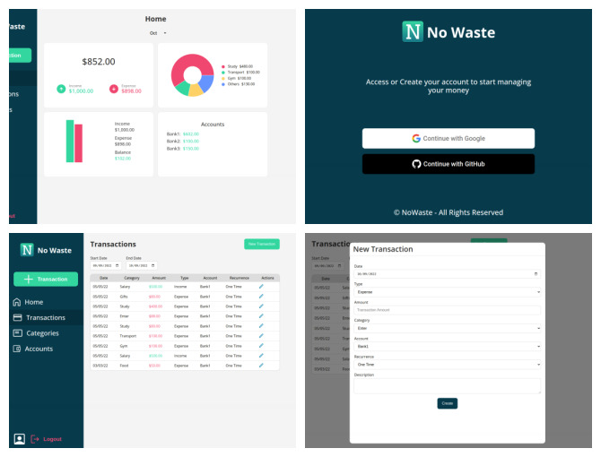

# NoWaste

An Open-Source SaaS Progressive Web App created to manage personal budget and track expenses.

Live app: https://nowaste-7acdd.web.app/

[See more screenshots](./docs/screenshots/)

## Features

- Manage own Expense Categories
- Manage own Income Categories
- Manage Accounts
- Create Expenses
- Create Accounts
- Automatic Account Balance Management based on Transactions
- Month status Dashboard
- Easy authentication using Google OAuth
- Internationalization (Currently supported languages are Portuguese and English)

## Tech/Tools

- Firebase
- Typescript
- React
- Styled Components
- I18n
- Recharts
- Express

## How to run Locally

- Run `npm install`
- Run `npm start`

**_NOTE:_** This command should start both the backend (Firebase Functions) and the frontend (React App). Since the local environment is using the Firebase emulator, it might take a few seconds until all the services (Auth, Firestore and Functions) are ready to use. It might be necessary to refresh the page a couple of times in order to be able to use the whole app normally.

## Contributions

Any contribution is more than welcome! Feel free to open an issue or a PR.

## License

[GNU General Public License v3.0](./LICENSE)
